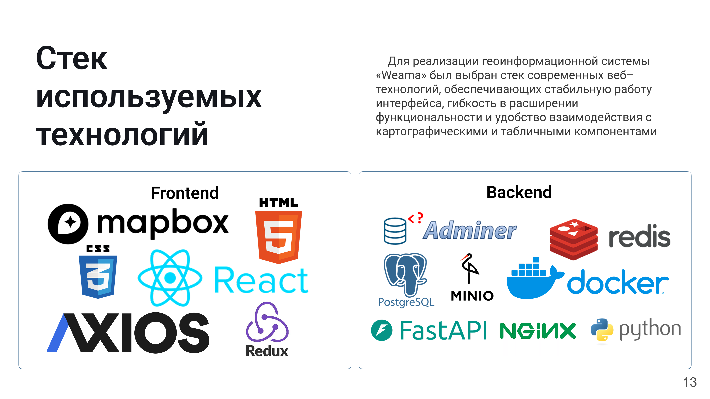
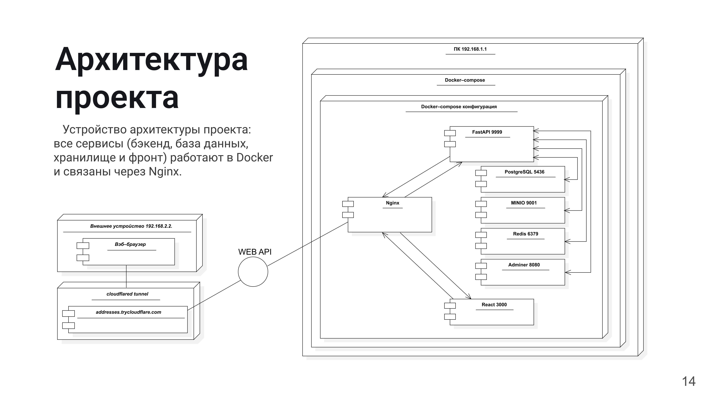
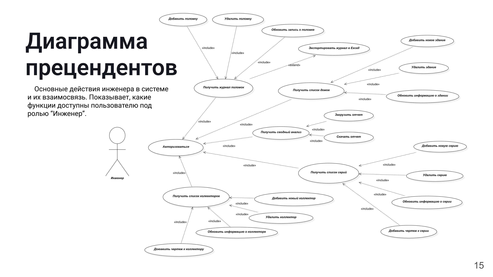

# Monitoring

[](https://www.python.org/)  
[](https://fastapi.tiangolo.com/)  
[](https://www.docker.com/)  

---

**Monitoring** — современная система для учёта инцидентов, управления сериями зданий и дизайнами коллекторов, построенная на FastAPI и контейнеризованная с помощью Docker.

---

## 📈 Стек технологий

Использованы передовые инструменты для надёжности, гибкости и удобства эксплуатации:

<p align="center">
  
</p>

| Область     | Технологии                                                  |
|-------------|-------------------------------------------------------------|
| **Frontend**  | React, Redux, Axios, Mapbox GL JS, CSS3, HTML5              |
| **Backend**   | Python, FastAPI, Uvicorn, SQLAlchemy (asyncpg), PostgreSQL, Redis, MinIO, Adminer |
| **Infra**     | Docker, Docker Compose, Nginx                                |

---

## 🏛 Архитектура

Все компоненты (бэкенд, база данных, файловое хранилище, фронтенд) разворачиваются в Docker-контейнерах и соединяются через Nginx.

<p align="center">
  
</p>

---

## 📋 Диаграмма прецедентов

Ключевые сценарии работы инженера в системе и их взаимосвязи.

<p align="center">
  
</p>

---

## 🚀 Быстрый старт

1. Клонировать:
   ```bash
   git clone git@github.com:<YOUR_USERNAME>/<YOUR_REPOSITORY>.git
   cd <YOUR_REPOSITORY>
   ```
2. Подготовить окружение:
   ```bash
   cp .env.example .env
   ```
3. Запуск:
   ```bash
   docker-compose up --build
   ```
4. Открыть:
   - Swagger UI: `http://localhost:8000/docs`  
   - Redoc: `http://localhost:8000/redoc`

---

**Присоединяйтесь к разработке и делайте Monitoring ещё лучше!**  
